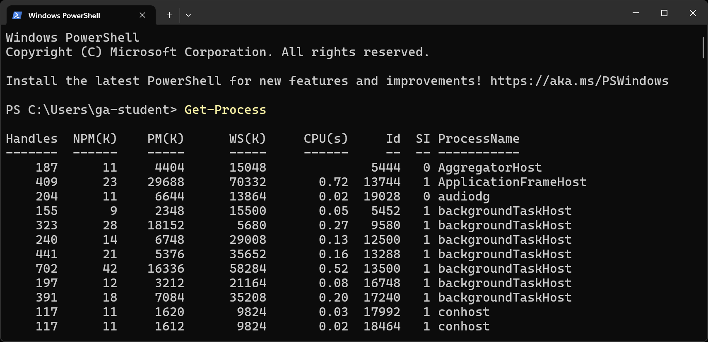

<h1>
  Intro to PowerShell Lab
  Gathering System Information and Process Management
</h1>

**Learning objective:** By the end of this exercise, students will be able to retrieve system information and perform basic process management tasks using PowerShell.

## Commands to learn

- `Get-Process`: Displays the processes running on the local computer.
- `Stop-Process`: Stops a running process.
- `Get-Service`: Retrieves information about services on the local computer. This cmdlet is only available using PowerShell in Windows.
- `Start-Service`: Starts a service. This cmdlet is only available using PowerShell in Windows.
- `Stop-Service`: Stops a service. This cmdlet is only available using PowerShell in Windows.
- `Get-ComputerInfo`: Retrieves detailed information about a Windows computer system. This cmdlet is only available using PowerShell in Windows.

## Practice

PowerShell provides a wealth of cmdlets for gathering system information and managing processes. Let's explore some useful commands that will help you gain insights into your system and control running processes.

1. Use `Get-Process` to display a list of running processes on your computer. The output will look something like the below:

   

2. Identify a non-critical process (for example, a text editor) and stop it using `Stop-Process`.

> 🚀 Feel free to check out more of the commands above using the PowerShell app in Windows.
